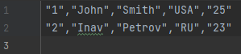
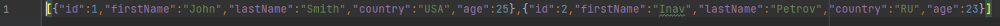
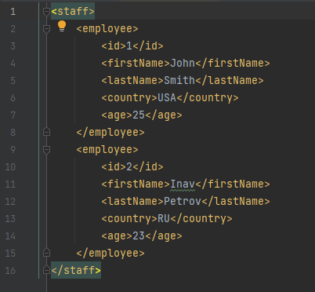
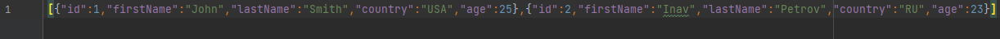
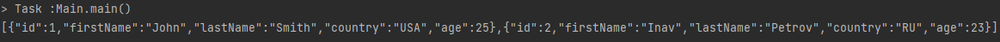

## Parcer
#### Общая цель программы заключается в обработке данных о сотрудниках, представленных в различных форматах (CSV и XML), и сохранении их в формате JSON. Программа состоит из нескольких этапов:

1. Создание списка сотрудников:

- Информация о сотрудниках хранится в объектах класса Employee.
Создается список сотрудников staff, содержащий объекты Employee.
2. Запись данных в CSV файл:

- Данные о сотрудниках сохраняются в CSV файл "data.csv" с использованием библиотеки OpenCSV.

- 
3. Чтение данных из CSV файла и запись в JSON:

- Данные о сотрудниках считываются из CSV файла "data.csv" с использованием библиотеки OpenCSV.
- Полученные данные преобразуются в JSON и сохраняются в файл "data.json" с использованием библиотеки Gson.
- 
3. Чтение данных из XML файла и запись в JSON:

- Данные о сотрудниках считываются из XML файла "data.xml".
- 
- Полученные данные преобразуются в JSON и сохраняются в файл "data2.json" с использованием библиотеки Gson.
- 
4. Чтение JSON из файла и преобразование в список сотрудников:

- JSON-строка с данными о сотрудниках считывается из файла "data2.json".
- Полученные JSON-данные преобразуются в список сотрудников.
5. Вывод JSON-строки на экран:

- JSON-строка, прочитанная из файла "data2.json", выводится на экран.
- 
#### Таким образом, программа предназначена для конвертации данных о сотрудниках из форматов CSV и XML в JSON, а также для чтения и вывода данных из JSON-файла.